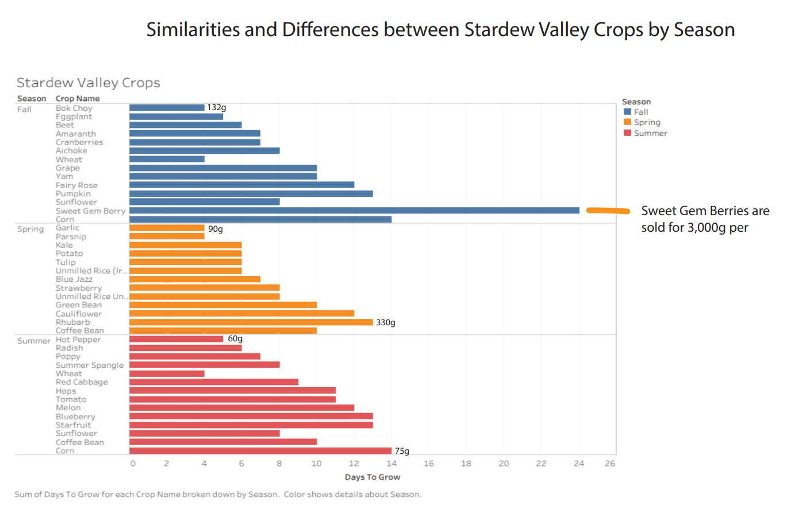
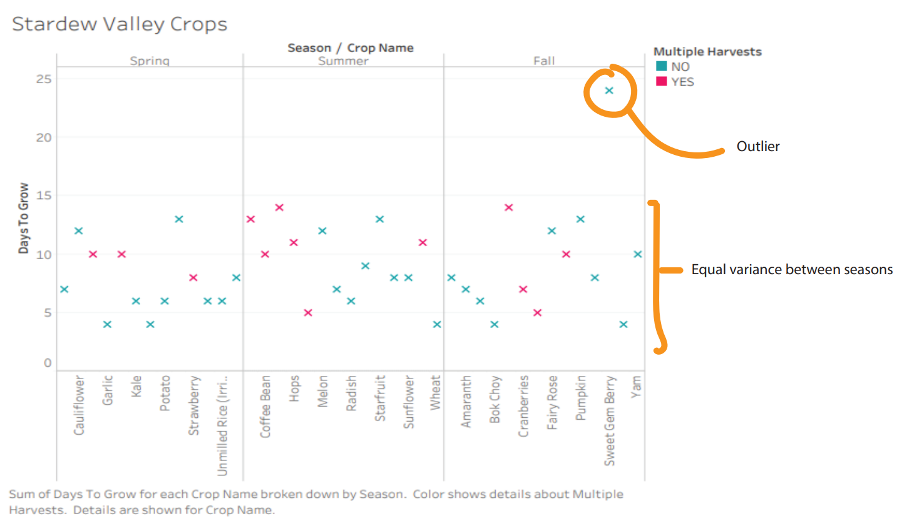
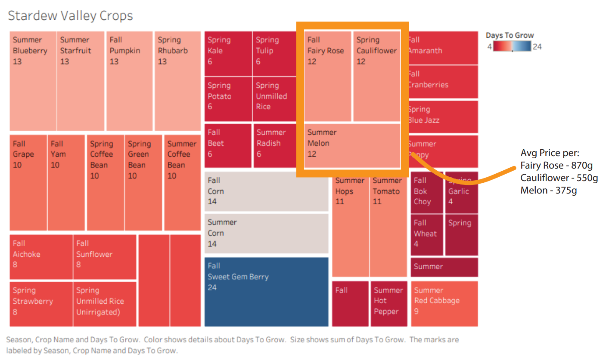

# Stardew Vally Crop Data Visualization Project
## Purpose
This project explores player data from Stardew Valley, a farming simulation game known for its open-ended gameplay and rich in-game economy. The purpose of this project is to practice data analysis and visualization techniques while uncovering interesting patterns and insights from the game world. The visualizations are shared here as part of an open, reproducible workflow to make the project useful for other Stardew Valley players, as well as a portfolio piece to demonstrate applied data science skills in a fun and accessible way.

The final product of the visualizations were produced on Tableau. 

## Data
I focused on the period from 05/04/2019 to 01/04/2024, mapping out common walking routes to and from the hospital from three distinct apartments where I lived while working as a nurse. I sourced the data from the Charlottesville Police Department website. Although the original police data did not include longitude and latitude columns, I used the GoogleMaps API to convert the address included in the dataset to the corresponding longitudes and latitudes. 

## Static Visualization of My Work

